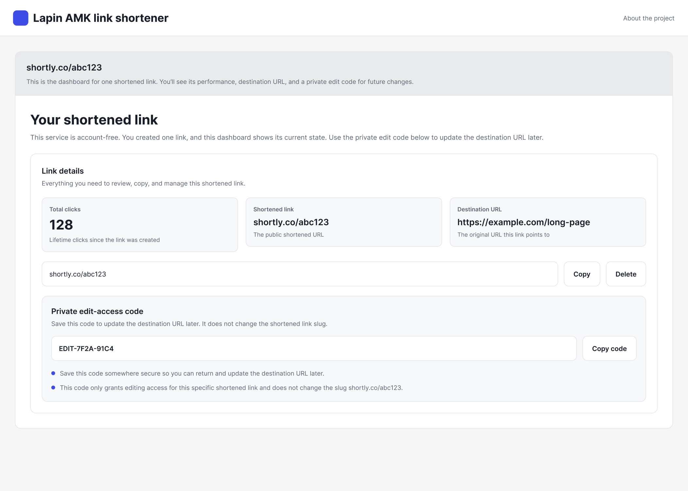
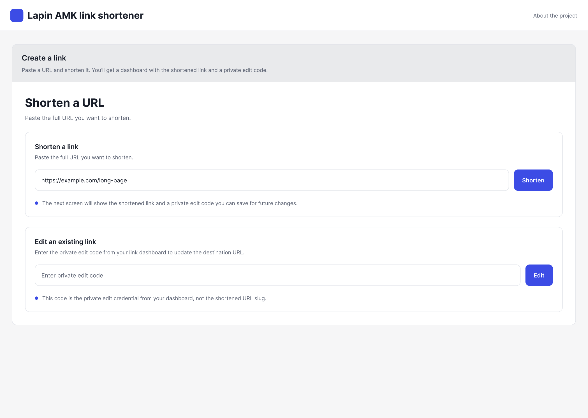
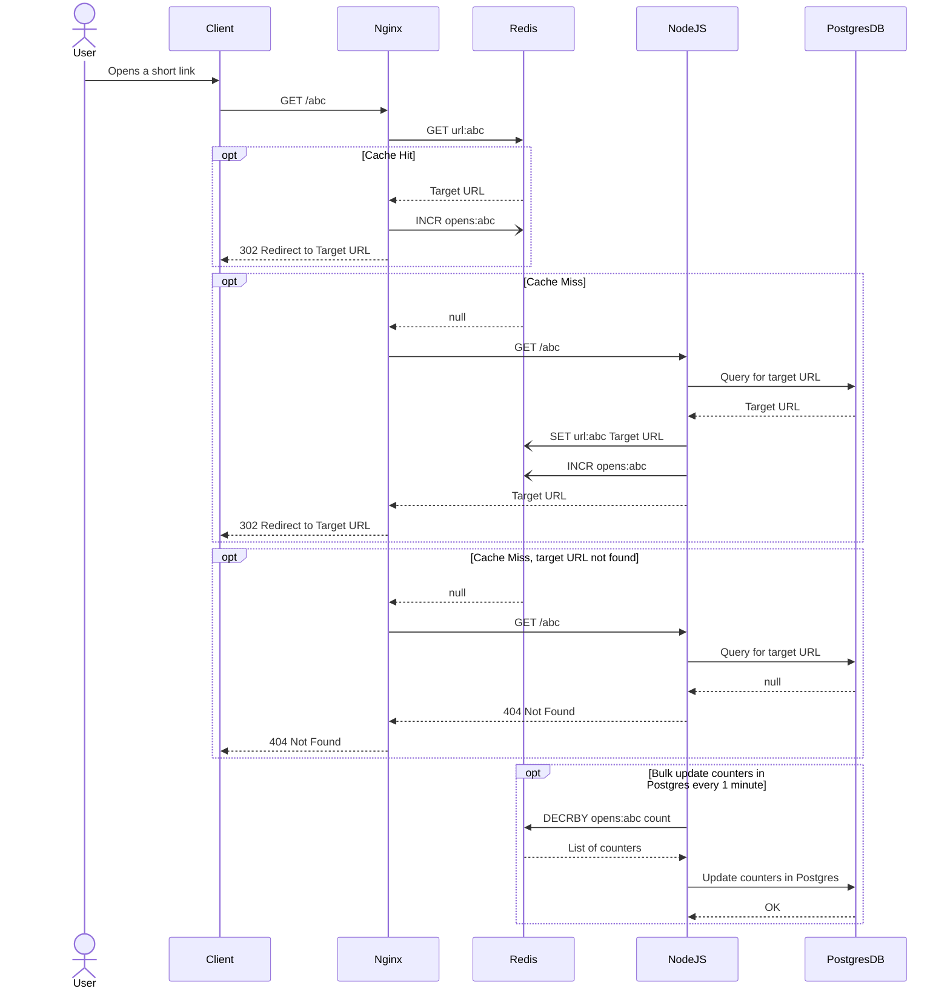
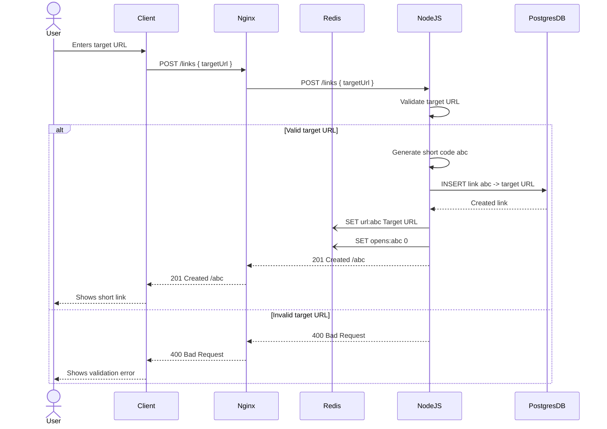
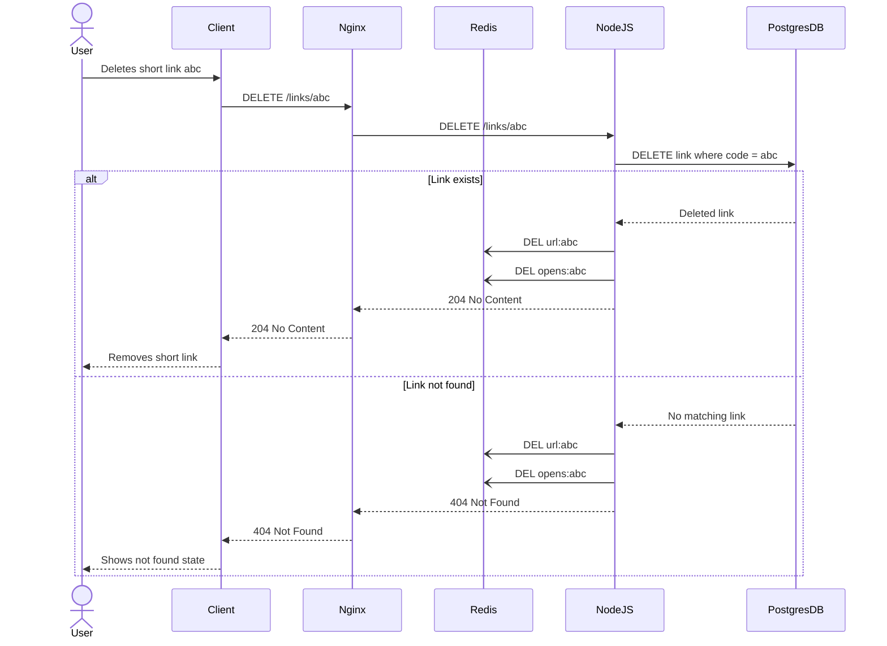

# Lapin AML link shortener project

This project is focused on building a web app for creating and serving short links like Bitly.

The main goal is to achieve a super low latency on a Read path (p50 <1ms at 50k RPS on a cache hit) and create a proper CI/CD pipeline using AWS for both FE and BE apps.

App's layout:

## Technical stack

The repository is a monorepo, which works on top of Turborepo (https://turborepo.dev/) and has several apps inside.

### Frontend

A frontend part is a React app, which uses a Tailwind and tools from a Tanstack project.

### Backend

A backend part will be written in TS & Deno. Nginx will work as a reverse proxy and will also call Redis cache, which will ensure a very low latency.

### Data storage

Links will be persistently stored in Postgres and added to Redis cache. Redis cache will be also responsible for counting link opens for analytics. Every minute counters will be updated in Postgres.

## Architecture diagrams

### Read path

### Write path

### Delete path

### Testing

Code will be covered with unit & E2E tests. Load testing will be done using k6 (https://k6.io/).

## Deployment

A full CI/CD will be configured and an app will be deployed to AWS every time a commit goes to the master branch.

### Frontend

A client app will be built, deployed and served in S3.

### API, DB & Cache

The rest of the application will be deployed in EC2 in Docker containers.
